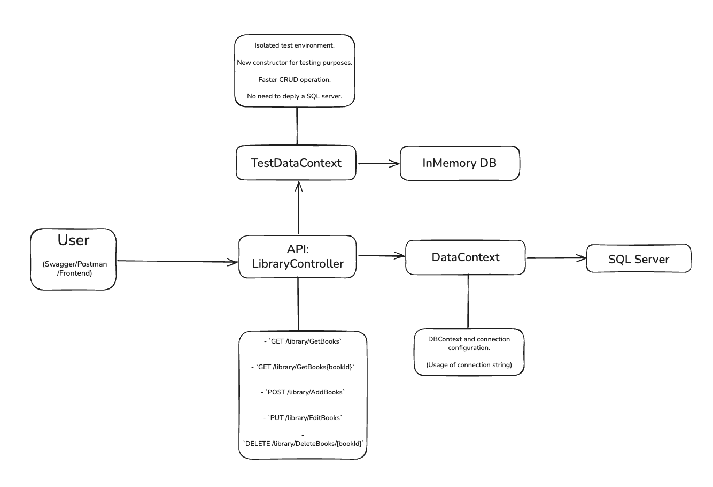
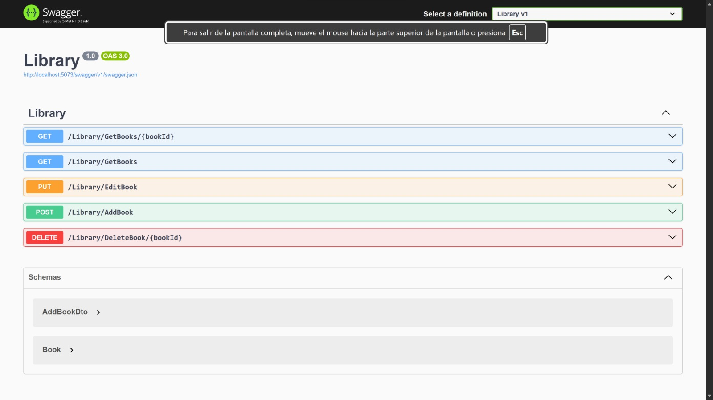

# Library
REST API to manage a library's database.


## Project structure
- `Program.cs` -> Configure services, CORS, nad registers controllers.
- `LibraryController.cs` -> Controller with CRUD endpoints.
- `DataContext.cs` -> Database context and connection configuration. 
- `Books.cs` -> Book entity.
- `BookDto.cs` -> Book dto used for add request.
- `Tests/` -> Integration tests using an InMemory database.

## Requirements
- .NET 0.9
- SQL Server

## Run locally
1. Update `appsettings.json` connection string to your SQL instance
2. From the project folder, run:

```bash
dotnet restore
dotnet build
dotnet run
```

3. The app will start at `http://localhost:5073` (It can be change at `launchSettings.json`).

4. A new browser with SwaggerUI will open or you can manually go to `http://localhost:5073/swagger` to test.

5. (Optional) Open `Library-http` and run each request using VSCode or copy them on postman.

## HTTP Endpoints

- `GET /library/GetBooks` -> Get all books
- `GET /library/GetBooks{bookId}` -> Get a book by ID
- `POST /library/AddBooks` -> Add a book
- `PUT /library/EditBooks` -> Update a book
- `DELETE /library/DeleteBooks/{bookId}` -> Delete a book by ID

## Tests

The integration test use an InMemory database to avoid connecting with the real database. Run the test with:
```bash
dotnet test
```
